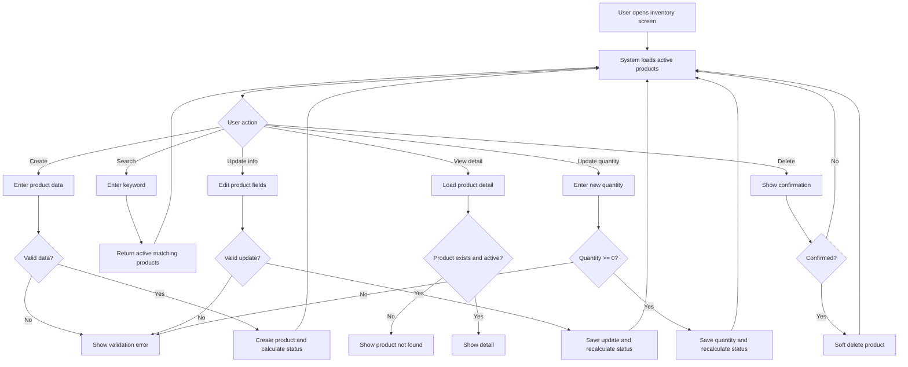

# req-001 Process BPMN

```mermaid
flowchart TD
    A[User opens inventory screen] --> B[System loads active products]
    B --> C{User action}
    C -->|Create| D[Enter product data]
    D --> E{Valid data?}
    E -->|No| F[Show validation error]
    E -->|Yes| G[Create product and calculate status]
    C -->|Search| H[Enter keyword]
    H --> I[Return active matching products]
    C -->|View detail| J[Load product detail]
    J --> K{Product exists and active?}
    K -->|No| L[Show product not found]
    K -->|Yes| M[Show detail]
    C -->|Update info| N[Edit product fields]
    N --> O{Valid update?}
    O -->|No| F
    O -->|Yes| P[Save update and recalculate status]
    C -->|Update quantity| Q[Enter new quantity]
    Q --> R{Quantity >= 0?}
    R -->|No| F
    R -->|Yes| S[Save quantity and recalculate status]
    C -->|Delete| T[Show confirmation]
    T --> U{Confirmed?}
    U -->|No| B
    U -->|Yes| V[Soft delete product]
    G --> B
    I --> B
    P --> B
    S --> B
    V --> B
```
