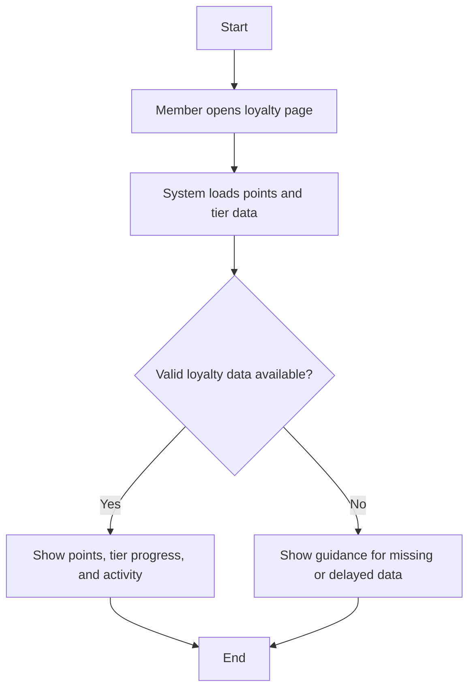

# BPMN Process: Loyalty Overview Expansion

- Requirement ID: `REQ-001`
## Mermaid Diagram

```mermaid
flowchart TD
    A[Start] --> B[Member opens loyalty page]
    B --> C[System loads points and tier data]
    C --> D{Valid loyalty data available?}
    D -->|Yes| E[Show points, tier progress, and activity]
    D -->|No| F[Show guidance for missing or delayed data]
    E --> G[End]
    F --> G[End]
```
