# Requirement Flow

## Requirement Overview
- Project Name: loyalty-feature-expansion
- Requirement ID: REQ-001
- Requirement Name: req-001
- Input File Path: /Users/macbookair/2B Agents/projects/loyalty-feature-expansion/inputs/requirements/req-001.md
- Last Updated: 2026-04-14
- Current Status: Done

## High-Level Requirement Flow

```mermaid
flowchart LR
    A[REQ-001 | req-001.md] --> B[BA Agent]
    B --> C[FRS + Feature List]
    C --> D[UXUI Agent]
    D --> E[Wireframe]
    E --> F[FE Agent]
    F --> G[ui.html]
    G --> H[Reviewer]
    H --> I[review-notes.md]
```

## Output Status

| Output File | Status |
|-------------|--------|
| clarification.md | ✅ Done |
| process-bpmn.md | ✅ Done |
| user-story.md | ✅ Done |
| acceptance-criteria.md | ✅ Done |
| brd.md | ✅ Done |
| frs.md | ✅ Done |
| feature-list.md | ✅ Done |
| wireframe.md | ✅ Done |
| ui.html | ✅ Done |
| review-notes.md | ✅ Done |

## Traceability

```mermaid
flowchart LR
    REQ[req-001.md] --> CLAR[✅ clarification.md]
    CLAR --> BPMN[✅ process-bpmn.md]
    BPMN --> STORY[✅ user-story.md]
    STORY --> AC[✅ acceptance-criteria.md]
    AC --> BRD[✅ brd.md]
    BRD --> FRS[✅ frs.md]
    FRS --> FEATURE[✅ feature-list.md]
    FEATURE --> WIRE[✅ wireframe.md]
    WIRE --> UI[✅ ui.html]
    UI --> REVIEW[✅ review-notes.md]
```



_Legend: ✅ done, ❌ missing, ⛔ blocked_

## Next Actions

- All outputs complete. Review for final approval.
