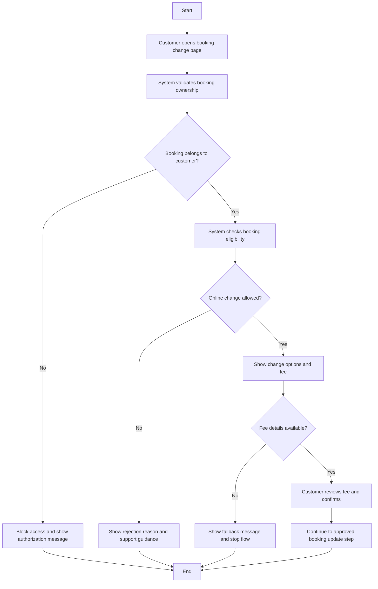

# Requirement: req-001

# BPMN Process: Ticket Booking Modification Improvement

- Requirement ID: `REQ-001`

## Mermaid Diagram

```mermaid
flowchart TD
    A[Start] --> B[Customer opens booking change page]
    B --> C[System validates booking ownership]
    C --> D{Booking belongs to customer?}
    D -->|No| E[Block access and show authorization message]
    D -->|Yes| F[System checks booking eligibility]
    F --> G{Online change allowed?}
    G -->|No| H[Show rejection reason and support guidance]
    G -->|Yes| I[Show change options and fee]
    I --> J{Fee details available?}
    J -->|No| K[Show fallback message and stop flow]
    J -->|Yes| L[Customer reviews fee and confirms]
    L --> M[Continue to approved booking update step]
    E --> N[End]
    H --> N
    K --> N
    M --> N
```
