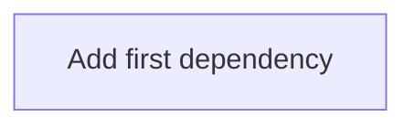

# Dependency Map

## Overview
- Project Name: project-template
- Last Updated:

## Dependency Table

| Item ID | Depends On | Type | Reason | Impact if Missing | Notes |
|--------|------------|------|--------|-------------------|------|
| - | - | - | Add dependency rows after the first requirement outputs are generated. | - | Start with REQ -> FR -> FEAT links. |

## Visual Dependency Graph

## Dependency Risks for Downstream Work
- Add risk notes after requirement processing starts.

<!-- TODO: Auto-refresh this file after each app.py run in new copied projects. -->

