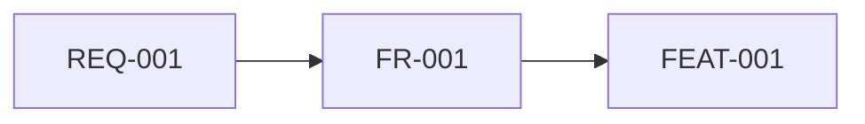

# Dependency Map

## Overview
- Project Name: ticket-booking-improvement
- Last Updated: 2026-04-18

## Dependency Table

| Item ID | Depends On | Type | Reason | Impact if Missing | Notes |
|--------|------------|------|--------|-------------------|------|
| FR-001 | REQ-001 | Functional Requirement | FR-001 is derived from REQ-001 | High | If the parent requirement changes, this FR must be reviewed. |
| FEAT-001 | FR-001 | Feature | FEAT-001 is derived from FR-001 | Medium | Feature details should follow the parent FR structure. |

## Visual Dependency Graph

## Dependency Risks for Downstream Work
- No high dependency risk detected from current project files.

<!-- TODO: Add optional manual dependency tags in requirement files for more precise mapping. -->
