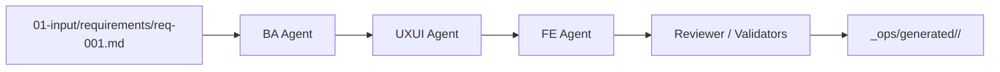
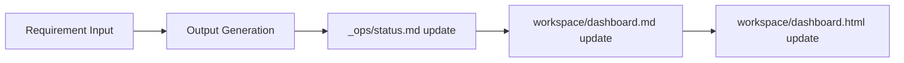

# Project Flow

## Project Overview
- Project Name: ticket-booking-improvement
- Current Stage: Draft
- Last Updated: 2026-04-18

## High-Level Flow

## Current Requirements

| Requirement | Status | BA | UXUI | FE | Reviewer | Output Folder |
|------------|--------|----|------|----|----------|---------------|
| req-001 | Done | ✅ | ✅ | ✅ | ✅ | _ops/generated/req-001 |

## Project Status Flow

### Traceability: req-001.md

```mermaid
flowchart LR
    REQ[req-001.md] --> CLAR[✅ clarification.md]
    CLAR --> BPMN[✅ process-bpmn.md]
    BPMN --> STORY[✅ user-story.md]
    STORY --> AC[✅ acceptance-criteria.md]
    AC --> BRD[✅ brd.md]
    BRD --> FRS[✅ frs.md]
    FRS --> FEATURE[✅ feature-list.md]
    FEATURE --> WIRE[✅ wireframe.md]
    WIRE --> UI[✅ ui.html]
    UI --> REVIEW[✅ review-notes.md]
```

_Legend: ✅ complete, ❌ missing_
