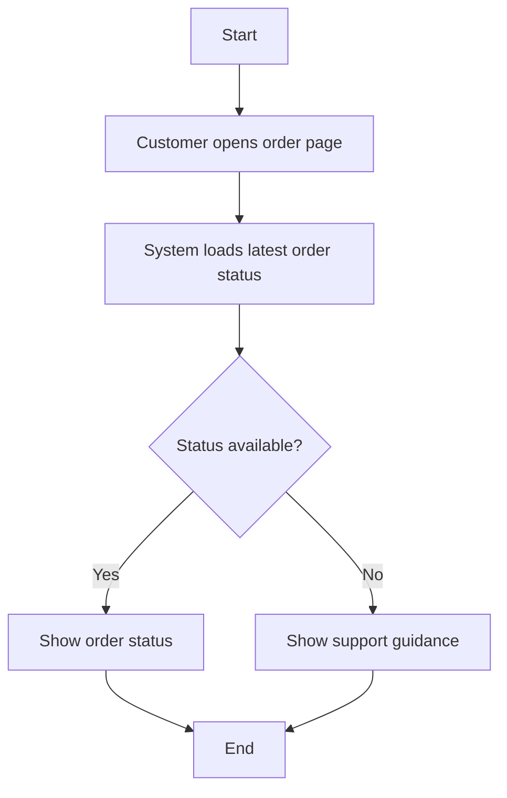

# BPMN Mermaid Writer

## Name

BPMN Mermaid Writer

## Purpose

Turn a business flow into a BPMN-style Mermaid diagram that BA, stakeholder, UXUI, and FE teams can review together.

## When To Use

Use this skill when:
- the team needs a visual process flow
- decisions and branches need to be clarified
- a BPMN-style process must be shared in Markdown

## Input Format

- clarified requirement
- process notes
- actors
- decisions or exception cases
- main flow and alternative flows from the FRS

## Output Format

- Mermaid flowchart in Markdown
- start and end points
- process steps
- decision nodes

## Step-by-Step Logic

1. Identify the main actor and start point.
2. List the key business steps.
3. Add decision points where the flow can branch.
4. Show how paths join or end.
5. Check the BPMN steps against the FRS main flow and alternative flows.
6. Keep the diagram readable for non-technical users.

## Constraints

- use Mermaid flowchart syntax only
- simulate BPMN using start/end, process, and decision nodes
- do not overload the diagram with too many side paths in the first version
- if the FRS has alternative flows, reflect them as BPMN decision branches
- if the BPMN shows a branch, ensure the FRS alternative flows describe it

## Expected Markdown Outputs

- `process-bpmn.md`

## Example Markdown Output

````md
# BPMN Process: Order Status Visibility


````
