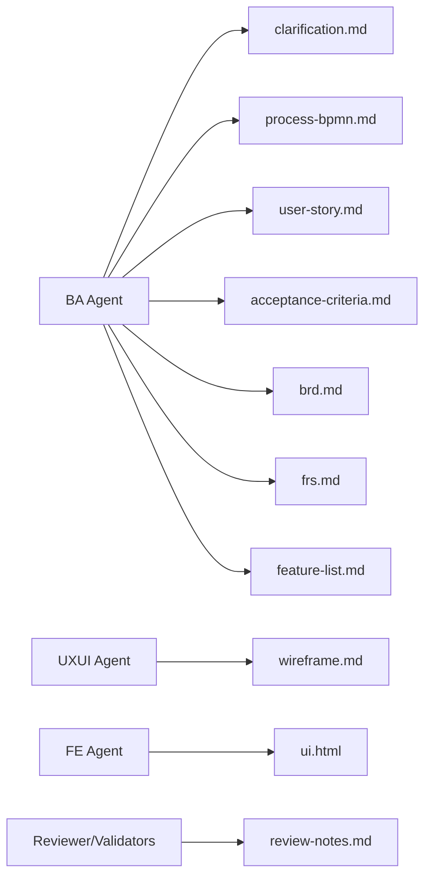
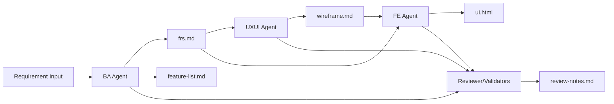
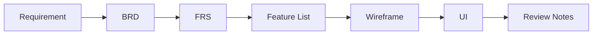

# Agent Flow (Responsibilities + Dependencies)

## A. Responsibility Flow

```mermaid
flowchart LR
    BA[BA Agent] --> CLAR[clarification.md]
    BA --> BPMN[process-bpmn.md]
    BA --> STORY[user-story.md]
    BA --> AC[acceptance-criteria.md]
    BA --> BRD[brd.md]
    BA --> FRS[frs.md]
    BA --> FEATURE[feature-list.md]

    UX[UXUI Agent] --> WIRE[wireframe.md]
    FE[FE Agent] --> UI[ui.html]
    RV[Reviewer/Validators] --> REVIEW[review-notes.md]
```

## B. Dependency Flow

```mermaid
flowchart LR
    INPUT[Requirement Input] --> BA[BA Agent]
    BA --> FRS[frs.md]
    BA --> FEATURE[feature-list.md]
    FRS --> UX[UXUI Agent]
    UX --> WIRE[wireframe.md]
    FRS --> FE[FE Agent]
    WIRE --> FE
    FE --> UI[ui.html]
    BA --> RV[Reviewer/Validators]
    UX --> RV
    FE --> RV
    RV --> REVIEW[review-notes.md]
```

## C. Traceability Chain

```mermaid
flowchart LR
    REQ[Requirement] --> BRD[BRD]
    BRD --> FRS[FRS]
    FRS --> FEATURE[Feature List]
    FEATURE --> WIRE[Wireframe]
    WIRE --> UI[UI]
    UI --> REVIEW[Review Notes]
```
