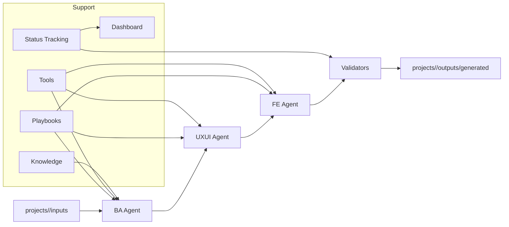

# System Flow (High Level)

This diagram shows the full system flow from project inputs to outputs.

```mermaid
flowchart LR
    A[projects/<project-name>/inputs] --> B[BA Agent]
    B --> C[UXUI Agent]
    C --> D[FE Agent]
    D --> E[Validators]
    E --> F[projects/<project-name>/outputs/generated]

    subgraph Support
        P[Playbooks]
        T[Tools]
        K[Knowledge]
        S[Status Tracking]
        DSH[Dashboard]
    end

    P --> B
    P --> C
    P --> D
    T --> B
    T --> C
    T --> D
    K --> B
    S --> E
    S --> DSH
```
