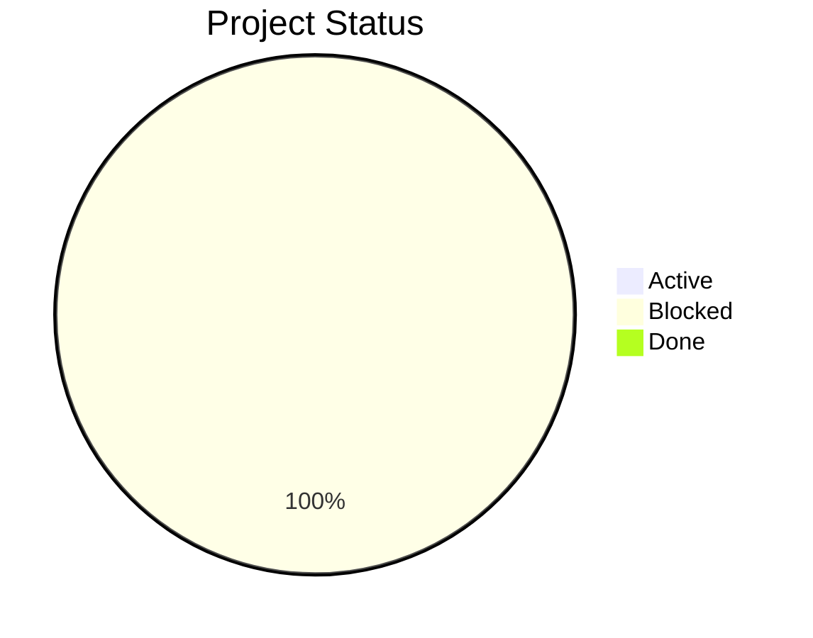
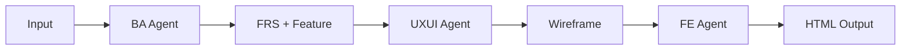

# Project Dashboard (Visual)

## 1. Overview Summary
- Total Projects: 2
- Active: 0
- Blocked: 2
- Done: 0

## 2. Status Highlight Table

| Project | Project Phase | Project Readiness | Project Owner | Project Status | Link |
|--------|---------------|------------------|---------------|----------------|------|
| loyalty-feature-expansion | Analysis | 90% | Product Analysis Team | 🔴 Blocked | [Open](../projects/loyalty-feature-expansion/) |
| ticket-booking-improvement | Analysis | 90% | BA Team | 🔴 Blocked | [Open](../projects/ticket-booking-improvement/) |

## 3. Status Breakdown (Pie)

## 4. Project Pipeline View

## 5. Blockers (All Projects)

### loyalty-feature-expansion
- Waiting for loyalty policy confirmation.

### ticket-booking-improvement
- Waiting for confirmation on fee disclosure policy.

## Project: loyalty-feature-expansion

### Project Summary
- Project Phase: Analysis
- Project Owner: Product Analysis Team
- Project Status: Blocked
- Project Readiness: 90%
- Last Update: 2026-04-15

### Execution Snapshot
- Current Execution Stage: ba-core
- Current Execution Owner: BA Agent
- Artifact Completion Rate: 80%
- Gate Summary: 12 Pass | 3 Warning | 0 Fail | 0 Not Allowed
- Current Artifact Statuses: Done: 12 | In Review: 3 | In Progress: 0 | Blocked: 0 | Rework Needed: 0 | Failed: 0
- Pending Confirmations: 1 (needs-more-info: 0)
- Blocked Reason: Waiting for loyalty policy confirmation.

### Requirement Summary
- Requirements: 1/1 processed
- Requirements:
  - req-001: Processed
- Current Risks:
  - Tier progress logic may differ across channels.
- Current Blockers:
  - Waiting for loyalty policy confirmation.
- Next Actions:
  - Validate tier calculation rules with loyalty operations.
  - Draft wireframe outline for the loyalty dashboard.
- Quick Links:
  - [Project README](../projects/loyalty-feature-expansion/README.md)
  - [Status](../projects/loyalty-feature-expansion/_ops/status.md)
  - [Decision Log](../projects/loyalty-feature-expansion/_ops/decision-log.md)
  - [Task Tracker](../projects/loyalty-feature-expansion/_ops/task-tracker.md)
  - [Outputs](../projects/loyalty-feature-expansion/02-output/)

## Project: ticket-booking-improvement

### Project Summary
- Project Phase: Analysis
- Project Owner: BA Team
- Project Status: Blocked
- Project Readiness: 90%
- Last Update: 2026-04-18

### Execution Snapshot
- Current Execution Stage: ba-core
- Current Execution Owner: BA Agent
- Artifact Completion Rate: 80%
- Gate Summary: 12 Pass | 3 Warning | 0 Fail | 0 Not Allowed
- Current Artifact Statuses: Done: 12 | In Review: 3 | In Progress: 0 | Blocked: 0 | Rework Needed: 0 | Failed: 0
- Pending Confirmations: 1 (needs-more-info: 0)
- Blocked Reason: Waiting for confirmation on fee disclosure policy.

### Requirement Summary
- Requirements: 1/1 processed
- Requirements:
  - req-001: Processed
- Current Risks:
  - Users may abandon self-service if eligibility rules remain unclear.
  - Fare rules may change and need a clear source of truth.
- Current Blockers:
  - Waiting for confirmation on fee disclosure policy.
- Next Actions:
  - Confirm change eligibility rules with ticketing policy owner.
  - Draft initial BPMN flow for change and refund steps.
- Quick Links:
  - [Project README](../projects/ticket-booking-improvement/README.md)
  - [Status](../projects/ticket-booking-improvement/_ops/status.md)
  - [Decision Log](../projects/ticket-booking-improvement/_ops/decision-log.md)
  - [Task Tracker](../projects/ticket-booking-improvement/_ops/task-tracker.md)
  - [Outputs](../projects/ticket-booking-improvement/02-output/)
