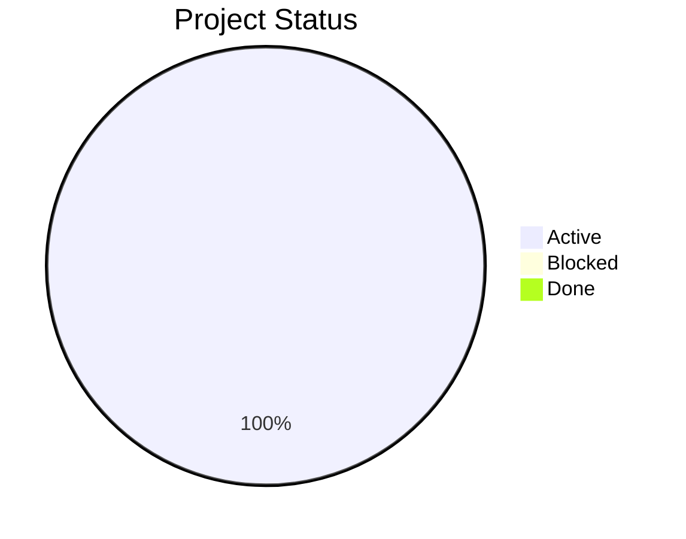
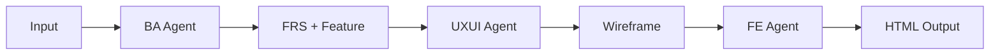

# Project Dashboard (Visual)

## 1. Overview Summary
- Total Projects: 2
- Active: 2
- Blocked: 0
- Done: 0

## 2. Status Highlight Table

| Project | Stage | Progress | Status | Link |
|--------|------|----------|--------|------|
| loyalty-feature-expansion | Analysis | 100% | 🟡 Active | [Open](../projects/loyalty-feature-expansion/) |
| ticket-booking-improvement | Analysis | 100% | 🟡 Active | [Open](../projects/ticket-booking-improvement/) |

## 3. Status Breakdown (Pie)

## 4. Project Pipeline View

## 5. Blockers (All Projects)

### loyalty-feature-expansion
- Waiting for loyalty policy confirmation.

### ticket-booking-improvement
- Waiting for confirmation on fee disclosure policy.

## Project: loyalty-feature-expansion

- Current Stage: Analysis
- Overall Progress: 100%
- Owner: Product Analysis Team
- Requirements:
  - req-001: Done
- Current Risks:
  - Tier progress logic may differ across channels.
- Current Blockers:
  - Waiting for loyalty policy confirmation.
- Next Actions:
  - Validate tier calculation rules with loyalty operations.
  - Draft wireframe outline for the loyalty dashboard.
- Quick Links:
  - [Project README](../projects/loyalty-feature-expansion/README.md)
  - [Status](../projects/loyalty-feature-expansion/_ops/status.md)
  - [Decision Log](../projects/loyalty-feature-expansion/_ops/decision-log.md)
  - [Task Tracker](../projects/loyalty-feature-expansion/_ops/task-tracker.md)
  - [Outputs](../projects/loyalty-feature-expansion/02-output/)

## Project: ticket-booking-improvement

- Current Stage: Analysis
- Overall Progress: 100%
- Owner: BA Team
- Requirements:
  - req-001: Done
- Current Risks:
  - Users may abandon self-service if eligibility rules remain unclear.
  - Fare rules may change and need a clear source of truth.
- Current Blockers:
  - Waiting for confirmation on fee disclosure policy.
- Next Actions:
  - Confirm change eligibility rules with ticketing policy owner.
  - Draft initial BPMN flow for change and refund steps.
- Quick Links:
  - [Project README](../projects/ticket-booking-improvement/README.md)
  - [Status](../projects/ticket-booking-improvement/_ops/status.md)
  - [Decision Log](../projects/ticket-booking-improvement/_ops/decision-log.md)
  - [Task Tracker](../projects/ticket-booking-improvement/_ops/task-tracker.md)
  - [Outputs](../projects/ticket-booking-improvement/02-output/)
