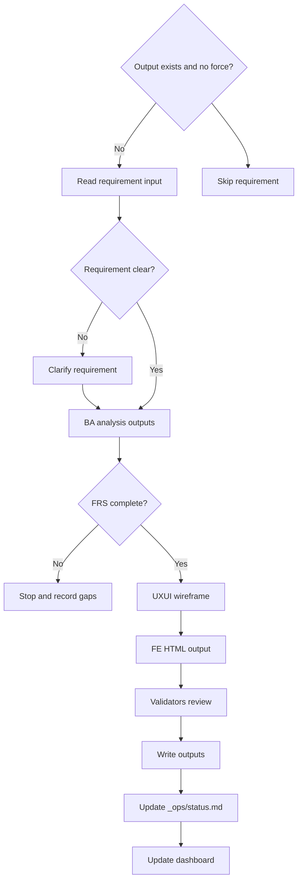
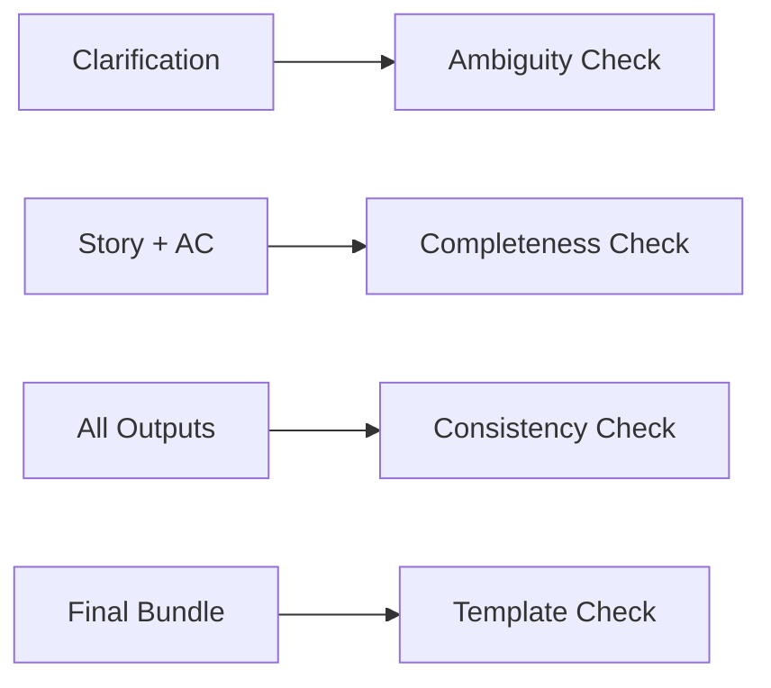

# Playbook Flow (Requirement to Product)

This diagram shows the end-to-end playbook flow, including decisions and validation.

```mermaid
flowchart TD
    A[Read requirement input] --> B{Requirement clear?}
    B -- No --> C[Clarify requirement]
    C --> D[BA analysis outputs]
    B -- Yes --> D

    D --> E{FRS complete?}
    E -- No --> F[Stop and record gaps]
    E -- Yes --> G[UXUI wireframe]
    G --> H[FE HTML output]
    H --> I[Validators review]
    I --> J[Write outputs]
    J --> K[Update _ops/status.md]
    K --> L[Update dashboard]

    M{Output exists and no force?} --> N[Skip requirement]
    M -- No --> A
```

## Validation Checkpoints (Simple View)

```mermaid
flowchart LR
    CLAR[Clarification] --> V1[Ambiguity Check]
    STORY[Story + AC] --> V2[Completeness Check]
    ALL[All Outputs] --> V3[Consistency Check]
    FINAL[Final Bundle] --> V4[Template Check]
```
