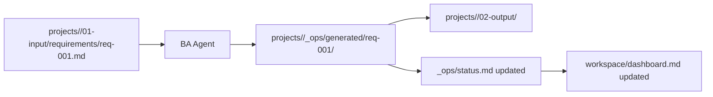

# Project Flow Template

Copy this template into a project-specific visual if needed.

## Notes

- Replace `<project-name>` and `req-001.md` with real names.
- Use this to explain one requirement lifecycle.
